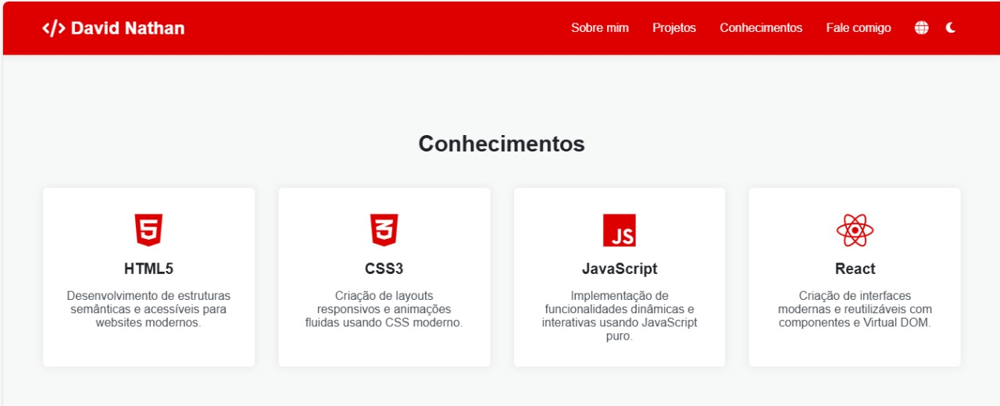

<h1 align="center"> Meu Portifólio 💻</h1>

<h4 align="center"><a href="[https://lucyanovidio.vercel.app](https://portifolio-six-omega-10.vercel.app/)">Confira o projeto aqui</a></h4>

---

## 💻 Sobre o projeto

Projeto feito no intuito de me apresentar, como desenvolvedor web front-end.

## 🤯 O site é composto por:

- **Home:** Minha apresentação;
- **Sobre mim:** Falo um pouco sobre minha trajetória e meu estado atual;
- **Projetos:** Alguns projetos recentes que fiz;
- **Conhecimentos:** As tecnologias que tenho conhecimento;
- **Fale comigo:** Área com meios para contato comigo;

## 🧠 Tecnologias utilizadas:

O site **ainda está em desenvolvimento**, pois estou em constante aprendizado. Mas até aqui utilizei as tecnologias:

    
    
    

## 📚 Alguns conceitos aplicados

Neste projeto apliquei os seguintes pontos:
+ Semântica HTML;
+ Pontos de acessibilidade;
+ Responsividade.

---

<table>
  <tr>
    <td>
      
    </td>
    <td>
      Feito por <a href="https://github.com/codebydavidd">David Nathan.</a>😁
    </td>
  </tr>
</table>
